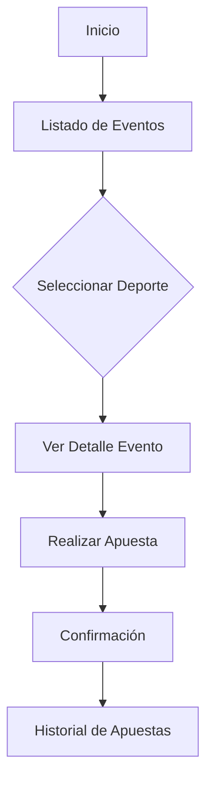
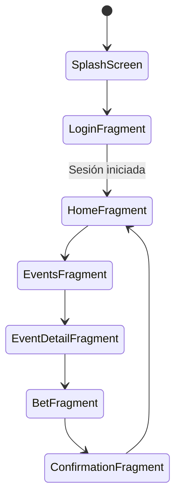

# App_TV_Apuestas

[](https://kotlinlang.org/) [](https://developer.android.com/studio)

> **Aplicación de apuestas para Android TV**, desarrollada en Android Studio con Java/Kotlin. Permite navegar por eventos deportivos, consultar cuotas y realizar apuestas desde la comodidad de tu televisor.

## 📝 Descripción  
Esta app está diseñada para Android TV y ofrece:  
- **Catálogo de eventos deportivos**: fútbol, baloncesto, tenis, etc.  
- **Detalle de cuotas**: muestra probabilidades y estadísticas clave.  
- **Interfaz adaptada a TV**: navegación con mando a distancia usando AndroidX Leanback.  
- **Registro y autenticación**: integración con API REST para gestionar usuarios y apuestas.  
- **Historial de apuestas**: seguimiento de resultados y balance.

## 🚀 Funcionalidades principales  


## 📂 Estructura de carpetas  
```bash
App_TV_Apuestas
└── TV_APP
    ├── app
    │   ├── src
    │   │   ├── main
    │   │   │   ├── java/com/chrisu/tvapuestas      # Código fuente Java/Kotlin
    │   │   │   ├── res                             # Recursos: layouts, drawables, valores
    │   │   │   └── AndroidManifest.xml             # Declaración de componentes
    │   ├── build.gradle                            # Configuración del módulo app
    │   └── proguard-rules.pro                      # Reglas de ofuscación
    ├── build.gradle                                # Configuración de Gradle de nivel superior
    ├── settings.gradle                             # Inclusión de módulos
    ├── gradlew                                     # Wrapper de Gradle (Linux/Mac)
    ├── gradlew.bat                                 # Wrapper de Gradle (Windows)
    └── gradle
        └── wrapper
            ├── gradle-wrapper.jar
            └── gradle-wrapper.properties
```

## 📦 Dependencias y librerías  
| Categoría            | Librería                    | Uso                                      |
|----------------------|-----------------------------|------------------------------------------|
| Networking           | Retrofit + OkHttp           | Consumo de API REST                      |
| Imágenes             | Glide                       | Carga y cache de imágenes                |
| UI TV                | AndroidX Leanback           | Componentes optimizados para TV          |
| JSON parsing         | Moshi / Gson                | Serialización y deserialización de datos |
| Coroutines / Async   | Kotlin Coroutines / RxJava  | Tareas asíncronas y gestión de hilos     |
| Material Design TV   | Material Components         | Controles y estilos adaptados a TV       |

## 🎨 Flujo de navegación (Diagrama de estados)  


## 📸 Capturas de pantalla  
<p align="center">
    
  
</p>

## ⚙️ Cómo empezar  
1. Clona el repositorio:  
   ```bash
   git clone https://github.com/ChrisUscanga/App_TV_Apuestas.git
   ```
2. Abre el proyecto en Android Studio.  
3. Sincroniza las dependencias con Gradle.  
4. Conecta un dispositivo Android TV o usa un emulador TV.  
5. Ejecuta la configuración de Run → TV_APP.

## 📄 Licencia  
Este proyecto está bajo la licencia MIT. Consulta [LICENSE](LICENSE) para más detalles.
